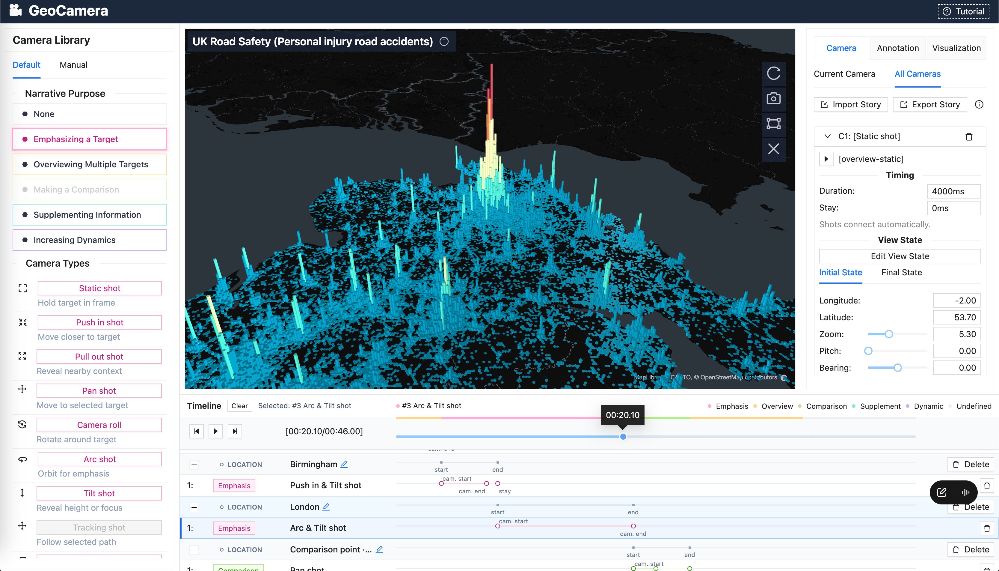

# GeoCamera

GeoCamera is the research demo accompanying the CHI 2023 paper **“GeoCamera: Telling Stories in Geographic Visualizations with Camera Movements.”** It helps authors create camera movements for geographic data stories by selecting geospatial targets, choosing camera shots for different narrative purposes, and arranging shots and annotations on a timeline.

Read the paper in the [ACM Digital Library](https://dl.acm.org/doi/10.1145/3544548.3581470), [Open-access preprint](https://arxiv.org/abs/2303.06460)
[Project page and videos](https://shellywhen.github.io/projects/GeoCamera)



## Features

- **Camera shots guided by narrative purpose.** Choose shots for emphasizing a target, overviewing multiple targets, making a comparison, supplementing information, or increasing dynamics.
- **Adaptive camera movements.** Select locations, regions, or paths and preview suitable shots, including push-in, pull-out, pan, arc, tilt, and tracking movements. Available shots depend on the selected targets and visualization.
- **Interactive story authoring.** Refine camera views and timing, add text annotations, and preview the sequence through the location–camera timeline.
- **Geographic visualizations and example data.** Explore hexagon aggregation, heatmap and scatter overlays, flow lines, scatterplots, and animated trips. Load compatible local CSV or JSON data through the visualization settings.
- **Story import and export.** Save camera movements, annotations, and scene home views as JSON and reload them for playback.

## Repository structure

GeoCamera is a browser application built with React, TypeScript, deck.gl, MapLibre GL JS, and Ant Design, bundled with webpack.

| Path                                       | Description                                                                     |
| ------------------------------------------ | ------------------------------------------------------------------------------- |
| [`src/components/`](src/components/)       | Map workspace, camera library, configuration panels, and timeline.              |
| [`src/camera/`](src/camera/)               | Camera-shot definitions, target selection, adaptive planning, and trajectories. |
| [`src/story/`](src/story/)                 | Story playback, timing, annotations, and JSON serialization.                    |
| [`src/visualization/`](src/visualization/) | Visualization layers, dataset loading, and display settings.                    |
| [`assets/`](assets/)                       | Camera and visualization catalogs, bundled datasets, and example stories.       |
| [`scripts/`](scripts/)                     | Regression-test runner.                                                        |

Data processing and story authoring run in the browser. The default configuration requires no separate backend or API key. Bundled data are served locally, while basemap styles, tiles, and fonts are requested from external map services.

## Quick start

### Prerequisites

- Node.js 22.15 or later and npm.
- A desktop browser with WebGL2 support and hardware acceleration enabled.
- An internet connection to install dependencies and load the default basemaps.

### 1. Install and start

From the repository root:

```sh
npm ci
npm start
```

Open [http://localhost:9000](http://localhost:9000). The application starts with the UK road safety hexagon visualization. Use **Tutorial** in the upper-right corner for a guided introduction.

### 2. Explore an example story

Select the corresponding visualization and dataset in **Visualization**, then open **Camera → All Cameras → Import Story** and choose a bundled file:

| Story file                                                              | Visualization     | Dataset                                         |
| ----------------------------------------------------------------------- | ----------------- | ----------------------------------------------- |
| [`story-uk-road-safety.json`](assets/story/story-uk-road-safety.json)   | Hexagon           | UK Road Safety (Personal injury road accidents) |
| [`story-us-gun-violence.json`](assets/story/story-us-gun-violence.json) | Heatmap + Scatter | US Gun Violence                                 |

Use the timeline controls to play or scrub through the story. Other bundled datasets include San Francisco bike parking, UK commuting flows, BART ridership flows, global airports, and Manhattan cab trips.

### 3. Create and save a story

1. Choose a visualization and dataset, then select objects or draw a region on the map.
2. Choose a narrative purpose in **Camera Library**, preview a camera shot, and add it to the story.
3. Adjust camera views and timing in **Camera**, and add text in **Annotation**.
4. Play the sequence from the timeline, then use **Camera → All Cameras → Export Story** to save `geo-camera-story.json`.

Story files store camera and annotation information; playback uses the currently selected visualization and dataset. Keep the matching data separately and select them before importing a story. Export your work before reloading or closing the page. To produce a video file, record the story during playback with a screen recorder.

## Build and development

Create a production build and serve it locally:

```sh
npm run build-prod
npm run offline
```

The build output is written to `dist/`. Open the address printed by the static server, normally [http://localhost:8080](http://localhost:8080). The `offline` command serves the built application locally; default basemaps still require network access.

| Command                | Description                                                           |
| ---------------------- | --------------------------------------------------------------------- |
| `npm start`            | Start the development server on port 9000.                            |
| `npm run build-dev`    | Create a development build in `dist/`.                                |
| `npm run build-prod`   | Create an optimized production build in `dist/`.                      |
| `npm run offline`      | Serve the existing `dist/` directory locally.                         |
| `npm run test:camera`  | Run the camera, story, visualization, and component regression tests. |
| `npm run typecheck`    | Check TypeScript types without emitting files.                        |
| `npm run lint`         | Check source code with ESLint.                                        |
| `npm run format:check` | Check formatting with Prettier.                                       |

## Citation

If you use GeoCamera in your research, please cite:

```bibtex
@inproceedings{li2023geocamera,
  author = {Li, Wenchao and Wang, Zhan and Wang, Yun and Weng, Di and Xie, Liwenhan and Chen, Siming and Zhang, Haidong and Qu, Huamin},
  title = {GeoCamera: Telling Stories in Geographic Visualizations with Camera Movements},
  year = {2023},
  isbn = {9781450394215},
  publisher = {Association for Computing Machinery},
  address = {New York, NY, USA},
  url = {https://doi.org/10.1145/3544548.3581470},
  doi = {10.1145/3544548.3581470},
  booktitle = {Proceedings of the 2023 CHI Conference on Human Factors in Computing Systems},
  articleno = {170},
  numpages = {15},
  location = {Hamburg, Germany},
  series = {CHI '23}
}
```

## Research software notice

This repository contains academic demonstration code for local exploration and research. Rendering and playback performance depend on the browser, GPU, and dataset size. Dataset descriptions and source links are available through the information icon beside the visualization title.

## License

The GeoCamera source code is licensed under the [Apache License 2.0](LICENSE).

Third-party dependencies, datasets, and map services retain their respective licenses and attribution requirements.
